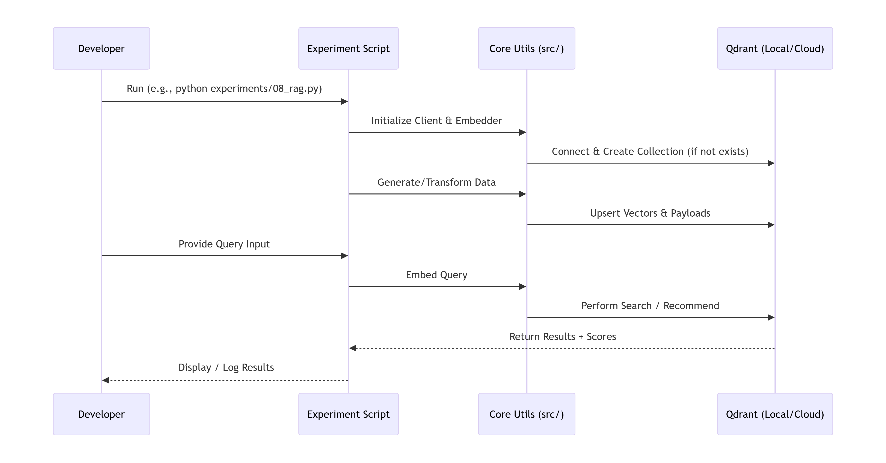

# 🧪 Qdrant Vector DB – Mastery Experiments

[](https://www.python.org/)
[](https://qdrant.tech/)
[](https://www.docker.com/)
[](LICENSE)

> **A structured, hands-on repository for mastering Qdrant—from basic CRUD to production-grade RAG and hybrid search.**

---

## 📖 Overview

This repository is your **complete learning companion** for [Qdrant](https://qdrant.tech/), the high-performance vector database.

Instead of scattered snippets, this repo provides a **progressive, phase-based curriculum**. Each script builds upon the last, taking you from a complete beginner to confidently building scalable, AI-powered retrieval systems.

**By the end of this journey, you will have executed 10 core experiments covering:**

- ✅ Basic CRUD & Payload Management
- ✅ Advanced Filtering (Geo, Range, Nested)
- ✅ Hybrid Search (Dense + Sparse BM42)
- ✅ Retrieval-Augmented Generation (RAG) Pipelines
- ✅ Performance Optimization (Quantization)
- ✅ Production Maintenance (Snapshots & Backup)

---

## 🏛️ System Architecture

The repository is designed to switch seamlessly between local development (Docker), in-memory testing, and Qdrant Cloud.



*Figure: High-level architecture showing how your experiments interact with Qdrant locally or in the cloud.*

### How an Experiment Executes

Every script follows this exact workflow to ensure reliability:

1. **Initialize** – The experiment script loads environment variables and connects to Qdrant via the client factory.
2. **Setup** – The script creates a collection (if it doesn't already exist) with the correct vector size and distance metric.
3. **Data Injection** – It generates synthetic data or loads real datasets, then upserts vectors and payloads in batches.
4. **Query** – The script embeds your search query (or uses raw vectors) and sends a search/recommendation request.
5. **Process** – Qdrant returns the top-K nearest neighbors with scores and metadata.
6. **Display** – Results are printed to the console and optionally logged for later analysis.

---

## 📂 Repository Structure

This modular structure ensures you can reuse the client, embedders, and synthetic data across all experiments.

```text
qdrant-experiments/
├── .env.example                 # Template for environment variables
├── .gitignore                   # Python, env, and data ignores
├── docker-compose.yml           # Spin up Qdrant instantly
├── pyproject.toml               # Modern Python dependency management
├── Makefile                     # Shortcuts (e.g., `make run-exp EX=05`)
├── README.md                    # This file!
│
├── config/                      # Global settings
│   └── settings.py              # Loads URLs, API keys, vector dimensions
│
├── src/                         # Reusable core library
│   ├── __init__.py
│   ├── client_factory.py        # Returns Qdrant client (local/cloud/memory)
│   ├── embedding_utils.py       # Wrappers for Sentence-Transformers
│   └── synthetic_data.py        # Generate dummy vectors & fake payloads
│
├── experiments/                 # 📌 THE MAIN LEARNING PATH
│   ├── 01_basic_crud.py
│   ├── 02_search_and_filter.py
│   ├── 03_batch_upsert_scroll.py
│   ├── 04_payload_indexing.py
│   ├── 05_geo_filtering.py
│   ├── 06_recommendation_api.py
│   ├── 07_hybrid_search_bm42.py
│   ├── 08_rag_text_embeddings.py
│   ├── 09_quantization_benchmark.py
│   └── 10_snapshots_backup.py
│
├── notebooks/
│   └── exploration.ipynb        # Visualize vectors & debugging
├── data/                        # Static datasets (e.g., Quora, Wiki snippets)
│   └── .gitkeep
├── tests/                       # Pytest suite to validate connections
│   ├── test_client.py
│   └── test_basic_flow.py
└── scripts/
    └── cleanup_collections.py   # Nuke all collections to start fresh